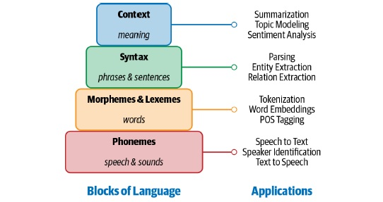
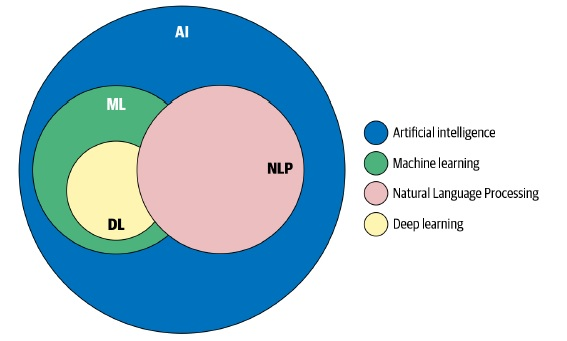

## Natural Language Processing (NLP)

### NLP Tasks

#### Language modeling

- This is the task of predicting what the next word in a sentence will be based on the history of previous words. 
- The goal of this task is to learn the probability of a sequence of words appearing in a given language.
- Main usages:
	- speech recognition
	- optical character recognition
	- handwriting recognition
	- machine translation
	- spelling correction

#### Text classification

- This is the task of bucketing the text into a known set of categories based on its content. 
- Text classification is by far the most popular task in NLP and is used in a variety of tools
- Main usages:
	- email spam identification
	- sentiment analysis.

#### Information extraction

- This is the task of extracting relevant information from text.
- Main usages:
	- calendar events from emails
	- the names of people mentioned in a social media post.

#### Information retrieval

- This is the task of finding documents relevant to a user query from a large collection.
- Main usages:
	- Google Search

#### Conversational agent

- This is the task of building dialogue systems that can converse in human languages.
- Main usages:
	- Google Assistant
	- Amazon Alexa
	- Apple Siri

#### Text summarization

- This task aims to create short summaries of longer documents while retaining the core content and preserving the overall meaning of the text.

#### Question answering

- This is the task of building a system that can automatically answer questions posed in natural language.

#### Machine translation

- This is the task of converting a piece of text from one language to another.
- Main usages:
	- Google Translate

#### Topic modeling

- This is the task of uncovering the topical structure of a large collection of documents.
- Topic modeling is a common text-mining tool and is used in a wide range of domains, from literature to bioinformatics.
 

### Building Blocks of Language
- The character based RNN will actually learn the structure of the text.
 

#### **Phonemes**

- Phonemes are the smallest units of sound in a language. They may not have any
meaning by themselves but can induce meanings when uttered in combination with
other phonemes. For example, standard English has 44 phonemes, which are either
single letters or a combination of letters [2]. Figure below shows these phonemes along
with sample words. 
- Phonemes are particularly important in applications involving speech understanding, such as _speech recognition_, _speech-to-text transcription_, and
_text-to-speech conversion_.
 

#### **Morphemes and lexemes**

- A morpheme is the smallest unit of language that has a meaning. It is formed by a
combination of phonemes. Not all morphemes are words, but all prefixes and suffixes
are morphemes. For example, in the word “multimedia,” “multi-” is not a word but a
prefix that changes the meaning when put together with “media.” “Multi-” is a morpheme.

- Lexemes are the structural variations of morphemes related to one another by meaning.
For example, “run” and “running” belong to the same lexeme form. 
- Morphological analysis, which analyzes the structure of words by studying its morphemes and
lexemes, is a foundational block for many NLP tasks, such as _tokenization_, _stemming_, _learning word embeddings_, and _part-of-speech tagging_.

#### **Syntax**

- Syntax is a set of rules to construct grammatically correct sentences out of words and
phrases in a language.

- Syntactic structure in linguistics is represented in many different ways. A common approach to representing sentences is a parse tree. 
- Figure below shows an example parse tree for two English sentences.
 

- This has a hierarchical structure of language, with words at the lowest level, followed
by part-of-speech tags, followed by phrases, and ending with a sentence at the highest
level. In Figure above, both sentences have a similar structure and hence a similar syntactic
parse tree. In this representation, N stands for noun, V for verb, and P for preposition.
Noun phrase is denoted by NP and verb phrase by VP. The two noun phrases
are “The girl” and “The boat,” while the two verb phrases are “laughed at the monkey”
and “sailed up the river.” The syntactic structure is guided by a set of grammar rules
for the language (e.g., the sentence comprises an NP and a VP), and this in turn
guides some of the fundamental tasks of language processing, such as _parsing_. 

- **Parsing** is the NLP task of constructing such trees automatically. _Entity extraction_ and
_relation extraction_ are some of the NLP tasks that build on this knowledge of _parsing_.

- Note that the parse structure described above is specific to English. The syntax of one language can be very different
from that of another language, and the language-processing approaches needed for that language will change accordingly.

#### **Context**

- Context is how various parts in a language come together to convey a particular meaning. 
- Context includes long-term references, world knowledge, and common sense along with the literal meaning of words and phrases. 
- The meaning of a sentence can change based on the context, as words and phrases can sometimes have multiple meanings. 
- Generally, context is composed from semantics and pragmatics. 
- Semantics is the direct meaning of the words and sentences without external context. 
- Pragmatics adds world knowledge and external context of the conversation to enable us to infer implied meaning. 
- Complex NLP tasks such as _sarcasm detection_, _summarization_, and _topic modeling_ are some of tasks that use context heavily.

### Why Is NLP Challenging?

#### Ambiguity

- Ambiguity means uncertainty of meaning. Most human languages are inherently ambiguous. 
- Consider the following sentence: “I made her duck.” This sentence has multiple meanings.
 

#### Common knowledge

- A key aspect of any human language is “common knowledge.” It is the set of all facts
that most humans are aware of. 
- In any conversation, it is assumed that these facts are known, hence they’re not explicitly mentioned, but they do have a bearing on the meaning of the sentence.

- For example, consider two sentences: “man bit dog” and “dog bit man.” We all know that the first sentence is unlikely to happen, while the second
one is very possible. Why do we say so? Because we all “know” that it is very
unlikely that a human will bite a dog. Further, dogs are known to bite humans. This
knowledge is required for us to say that the first sentence is unlikely to happen while
the second one is possible. 
- Note that this common knowledge was not mentioned in either sentence. 
- Humans use common knowledge all the time to understand and
process any language. In the above example, the two sentences are syntactically very
similar, but a computer would find it very difficult to differentiate between the two, as
it lacks the common knowledge humans have. 
- One of the key challenges in NLP is how to encode all the things that are common knowledge to humans in a computational model.

#### Creativity

- Language is not just rule driven; there is also a creative aspect to it. 
- Various styles, dialects, genres, and variations are used in any language. 
- Poems are a great example of creativity in language. 
- Making machines understand creativity is a hard problem not just in NLP, but in AI in general.

#### Diversity across languages

- For most languages in the world, there is no direct mapping between the vocabularies
of any two languages. This makes porting an NLP solution from one language to another hard.

- A solution that works for one language might not work at all for another language. This means that one either builds a solution that is language agnostic
or that one needs to build separate solutions for each language. While the first one is conceptually very hard, the other is laborious and time intensive.

### Machine Learning, Deep Learning, and NLP 
 

## Approaches to NLP

### Heuristics-Based NLP

- Early attempts at designing NLP systems were based on building rules for the task at hand. 
- This required that the developers had some expertise in the domain to formulate rules that could be incorporated into a program.

- Such systems also required resources like _dictionaries_ and _thesauruses_, typically compiled and digitized over a period of time. 
- An example of designing rules to solve an NLP problem using such resources is lexicon-based sentiment analysis. It uses counts
of positive and negative words in the text to deduce the sentiment of the text.

- More elaborate knowledge bases have been built to aid NLP in general and rule-based NLP in particular. 
- One example is Wordnet, which is a database of words and the semantic relationships between them.
- Synonyms refer to words with similar meanings. 
- Hyponyms capture is-type-of relationships. For example, baseball, sumo wrestling, and tennis are all hyponyms of sports. 
- Meronyms capture is-part-of relationships.

- __Regular expressions (regex)__ are a great tool for text analysis and building rule-based systems. 
- A regex is a set of characters or a pattern that is used to match and find substrings in text.
- Regexes are a great way to incorporate domain knowledge in your NLP system. For example, given a customer
complaint that comes via chat or email, we want to build a system to automatically identify the product the complaint is about. 
- There is a range of product codes that map to certain brand names. 
- We can use regexes to match these easily.

- _Rules and heuristics_ play a role across the entire life cycle of NLP projects even now.
At one end, they’re a great way to build first versions of NLP systems. 
- Put simply, _rules and heuristics_ help you quickly build the first version of the model and get a
better understanding of the problem at hand.

### Machine Learning for NLP

- Any machine learning approach for NLP, supervised or unsupervised, can be
described as consisting of three common steps: 
	- Extracting features from text
	- Using the _feature representation_ to learn a model
	- Evaluating and improving the model

#### **Naive Bayes**
- Naive Bayes is a classic algorithm for classification tasks that mainly relies on
Bayes’ theorem
- Using Bayes’ theorem, it calculates the probability of observing a class label given the set of features for the input data.
- A characteristic of this algorithm is that it assumes each feature is independent of all other features.
- For the news classification example, one way to represent the text numerically is by using the count of domain-specific
words, such as sport-specific or politics-specific words, present in the text. 
- We assume that these word counts are not correlated to one another. If the assumption holds, we can use Naive Bayes to classify news articles. 
- While this is a strong assumption to make in many cases, Naive Bayes is commonly used as a starting algorithm for text classification. 
- This is primarily because it is simple to understand and very fast to train and run.

#### **Support vector machine**
- The support vector machine (SVM) is another popular classification algorithm.
- The goal in any classification approach is to learn a decision boundary that acts as a
separation between different categories of text (e.g., politics versus sports in our news
classification example). 
- This decision boundary can be linear or nonlinear (e.g., a circle).
- An SVM can learn both a linear and nonlinear decision boundary to separate
data points belonging to different classes. 
- A linear decision boundary learns to represent the data in a way that the class differences become apparent. 
- An SVM learns an optimal decision boundary so that the distance between points across classes is at its maximum. 
- The biggest strength of SVMs are their robustness to variation and noise in the data. 
- A major weakness is the time taken to train and the inability to scale when there are large amounts of training data.

#### **Hidden Markov Model**
- The hidden Markov model (HMM) is a statistical model that assumes there is an
underlying, unobservable process with hidden states that generates the data—i.e., we
can only observe the data once it is generated. 
- An HMM then tries to model the hidden states from this data. For example, consider the NLP task of part-of-speech (POS)
tagging, which deals with assigning part-of-speech tags to sentences. 
- HMMs are used for POS tagging of text data. Here, we assume that the text is generated according to
an underlying grammar, which is hidden underneath the text. 
- The hidden states are parts of speech that inherently define the structure of the sentence following the language
grammar, but we only observe the words that are governed by these latent states. 
- Along with this, HMMs also make the Markov assumption, which means that
each hidden state is dependent on the previous state(s). 
- Human language is sequential in nature, and the current word in a sentence depends on what occurred before it.
- Hence, HMMs with these two assumptions are a powerful tool for modeling textual data.

#### **Conditional random fields**
- The conditional random field (CRF) is another algorithm that is used for sequential
data. Conceptually, a CRF essentially performs a classification task on each element in
the sequence. 
- Imagine the same example of POS tagging, where a CRF can tag
word by word by classifying them to one of the parts of speech from the pool of all
POS tags. Since it takes the sequential input and the context of tags into consideration,
it becomes more expressive than the usual classification methods and generally
performs better. 
- CRFs outperform HMMs for tasks such as POS tagging, which rely on the sequential nature of language.

### Deep Learning for NLP

#### **Recurrent neural networks**
- language is inherently sequential. A sentence in any language
flows from one direction to another (e.g., English reads from left to right).
Thus, a model that can progressively read an input text from one end to another can
be very useful for language understanding.
- Recurrent neural networks (RNNs) are
specially designed to keep such sequential processing and learning in mind. RNNs
have neural units that are capable of remembering what they have processed so far.
This memory is temporal, and the information is stored and updated with every time
step as the RNN reads the next word in the input.
- RNNs are powerful and work very well for solving a variety of NLP tasks, such as _text
classification_, _named entity recognition_, _machine translation_, etc. 
- One can also use RNNs to generate text where the goal is to read the preceding text and predict the
next word or the next character.

#### **Long short-term memory**
- Despite their capability and versatility, RNNs suffer from the problem of forgetful
memory—they cannot remember longer contexts and therefore do not perform well
when the input text is long, which is typically the case with text inputs. 
- Long shortterm memory networks (LSTMs), a type of RNN, were invented to mitigate this
shortcoming of the RNNs. LSTMs circumvent this problem by letting go of the irrelevant
context and only remembering the part of the context that is needed to solve the
task at hand. This relieves the load of remembering very long context in one vector
representation. 
- LSTMs have replaced RNNs in most applications because of this workaround. Gated recurrent units (GRUs) are another variant of RNNs that are used
mostly in language generation.

#### **Convolutional neural networks**
- Convolutional neural networks (CNNs) are very popular and used heavily in computer
vision tasks like image classification, video recognition, etc. CNNs have also
seen success in NLP, especially in text-classification tasks.
- One can replace each word in a sentence with its corresponding word vector, and all vectors are of the same size
(d).
- Thus, they can be stacked one over another to form a matrix or 2D array of dimension n ✕ d, where n is the number of
words in the sentence and d is the size of the word vectors. This matrix can now be treated similar to an image and can be modeled by a CNN.
- The main advantage
CNNs have is their ability to look at a group of words together using a context window.
For example, we are doing sentiment classification, and we get a sentence like, “I
like this movie very much!” In order to make sense of this sentence, it is better to look
at words and different sets of contiguous words. CNNs can do exactly this by definition
of their architecture.
- CNN uses a collection of convolution and pooling layers to
achieve this condensed representation of the text, which is then fed as input to a fully
connected layer to learn some NLP tasks like text classification.

#### **Transformers**
- Transformers are the latest entry in the league of deep learning models for NLP.
Transformer models have achieved state of the art in almost all major NLP tasks in
the past two years. **They model the textual context but not in a sequential manner.
Given a word in the input, it prefers to look at all the words around it (known as _self attention_)
and represent each word with respect to its context**. For example, the word
“bank” can have different meanings depending on the context in which it appears. If
the context talks about finance, then “bank” probably denotes a financial institution.
On the other hand, if the context mentions a river, then it probably indicates a bank
of the river. Transformers can model such context and hence have been used heavily in NLP tasks due to this higher representation capacity as compared to other deep
networks.
- Recently, large transformers have been used for transfer learning with smaller downstream
tasks. Transfer learning is a technique in AI where the knowledge gained
while solving one problem is applied to a different but related problem. With transformers,
the idea is to train a very large transformer mode in an unsupervised manner
(known as pre-training) to predict a part of a sentence given the rest of the
content so that it can encode the high-level nuances of the language in it. These models
are trained on more than 40 GB of textual data, scraped from the whole internet.
An example of a large transformer is **BERT (Bidirectional Encoder Representations
from Transformers)**, which is pre-trained on massive data and open sourced by Google.

#### **Autoencoders**
- An autoencoder is a different kind of network that is used mainly for learning compressed
vector representation of the input. For example, if we want to represent a text
by a vector, what is a good way to do it? We can learn a mapping function from input
text to the vector. To make this mapping function useful, we “reconstruct” the input
back from the vector representation. This is a form of unsupervised learning since
you don’t need human-annotated labels for it. After the training, we collect the vector
representation, which serves as an encoding of the input text as a dense vector.
- An autoencoder is a neural network with three layers: an input layer, a hidden
(encoding) layer, and an output (decoding) layer. 
- The network is trained to reconstruct the inputs it receives in
the output layer; in other words, the network is trained
to output the exact same values that it received as input.
- A very important feature in these networks is that they
are designed so that it is not possible for the network to
simply copy the inputs to the outputs. For example, an
autoencoder may have fewer neurons in the hidden layer
than in the input and output layer. Because the autoencoder
is trying to reconstruct the input at the output layer,
the fact that the information from the input must pass
through this bottleneck in the hidden layer forces the autoencoder
to learn an encoding of the input data in the hidden layer that captures only the most important features
in the input, and disregards redundant or superfluous information.

## Why Deep Learning Is Not Yet the Silver Bullet for NLP

- _Overfitting on small datasets_
- _Few-shot learning and synthetic data generation_
- _Domain adaptation_
- _Interpretable models_
- _Common sense and world knowledge_
- _Cost_
- _On-device deployment_

## An NLP Walkthrough: Conversational Agents

- Voice-based conversational agents like Amazon Alexa and Apple Siri are some of the
most ubiquitous applications of NLP, and they’re the ones most people are already
familiar with. Figure below shows the typical interaction model of a conversational agent.
 

1. _Speech recognition and synthesis_: These are the main components of any voicebased
conversational agent. Speech recognition involves converting speech signals
to their phonemes, which are then transcribed as words. Speech synthesis
achieves the reverse process by transforming textual results into spoken language
to the user. Both of these techniques have advanced considerably in the last decade,
and we recommend using _cloud APIs_ for most standard cases.

2. _Natural language understanding_: This is the next component in the conversational
agent pipeline, where the user response received (transcribed as text) is analyzed
using a natural language understanding system. This can be broken into many
small NLP subtasks, such as:
	- _Sentiment analysis_: Here, we analyze the sentiment of the user response. 
	- _Named entity recognition_: Here, we identify all the important entities the user
mentioned in their response.
	- _Coreference resolution_: Here, we find out the references of the extracted entities
from the conversation history. For example, a user may say “Avengers Endgame
was awesome” and later refer back to the movie, saying “The movie’s special
effects were great.” In this case, we would want to link that “movie” is referring
to Avengers Endgame.

3. _Dialog management_: Once we’ve extracted the useful information from the user’s
response, we may want to understand the user’s intent—i.e., if they’re asking a
factual question like “What is the weather today?” or giving a command like
“Play Mozart songs.” We can use a text-classification system to classify the user
response as one of the pre-defined intents. This helps the conversational agent
know what’s being asked.
During this process, the system may ask a few clarifying questions to elicit further information from the user. Once we’ve figured out the user’s intent, we want
to figure out which suitable action the conversational agent should take to fulfill
the user’s request. This is done based on the information and intent extracted
from the user’s response. Examples of suitable actions could be generating an
answer from the internet, playing music, dimming lights, or asking a clarifying
question.

4. _Response generation_: Finally, the conversational agent generates a suitable action
to perform based on a semantic interpretation of the user’s intent and additional
inputs from the dialogue with the user. As mentioned earlier, the agent can
retrieve information from the knowledge base and generate responses using a
pre-defined template. For example, it might respond by saying, “Now playing
Symphony No. 25” or “The lights have been dimmed.” In certain scenarios, it can
also generate a completely new response.

_Content Source_: 
- Practical Natural Language Processing Chapter 1 ISBN: 978-1-492-05405-4
- Deep Learning. Cambridge: MIT Press, 2016. ISBN: 978-0-262-03561-3
